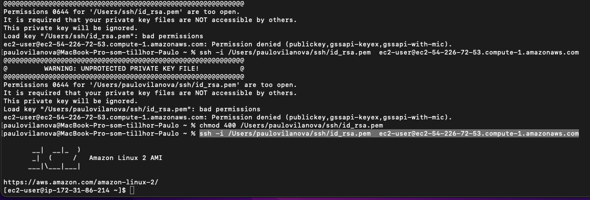

# Docker – AWS – Wordpress. Documentation

## Install Wordpress using docker:

Link: https://docs.docker.com/samples/wordpress/

In https://hub.docker.com/

- Search for Wordpress, Mysql and phpmyadmin

Create a yaml file

> touch docker-compose.yml

> docker ps

> docker-compose up -d (Will generate the wordpress)

> docker-compose up

# Jenkins:

https://www.jenkins.io/

• Install the latest LTS version: brew install jenkins-lts
• Start the Jenkins service: brew services start jenkins-lts

After start I need to open in http://localhost:8080/ and a password will be required:
Copy the url provided after start and use the terminal to get the password:

## In terminal: cat 'url-privided'

<ol>
  <li>Create your account</li>
  <li>Set all default installation</li>
  <li>Create a Job</li>
  <li>Choose Pipeline</li>
  <li>Pipeline Script and in the right side choose Scripted Pipeline</li>
  <li>Scripted Pipeline starts with node {}</li>
  <li>Declarative Pipeline starts with pipeline{}</li>
</ol>

## Create a Security Group

Inbound rules:
Port Range: 8080

Port range: 22

## IMPORTANT:

<ol>
<li>After the Security Group go to Launch Instances and run the instance.</li>
<li>Copy the Public DNS (IPV4) url</li>
<li>Create a Key-par (.pem)</li>
<li>In terminal run: chmod 400 my-key-pair.pem to set permition in the Key</li>
<li>Then run:  ssh -i /Users/paulovilanova/ssh/id_rsa.pem ec2-user@[Public DNS (IPV4)]</li>
</ol>
 

 

## Install Jenkins

### sudo wget -O /etc/yum.repos.d/jenkins.repo http://pkg.jenkins-ci.org/redhat/jenkins.repo

## Jenkings organization signing key

### sudo rpm --import https://pkg.jenkins.io/redhat/jenkins.io.key

## Install Java

### sudo yum install java-1.8.0

## Jenkins

Install:

### sudo yum install jenkins -y

Run Service:

### sudo systemctl start jenkins.service
